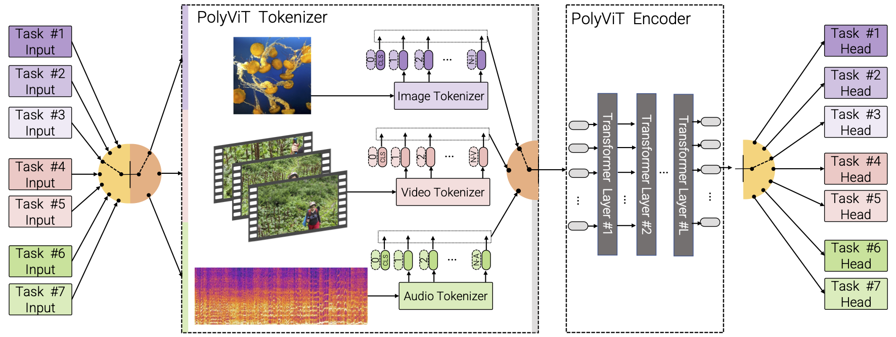

PolyViT: Co-training Vision Transformers on Images, Videos and Audio
==


PolyViT is a transformer model that has been trained on multiple tasks and
modalities, including images, audio, and video. This approach allows PolyViT
to achieve improved accuracy on five video and audio classification datasets,
while using fewer parameters than other models. In particular, when trained on
9 datasets across three modalities, PolyViT uses 8.3 times fewer parameters than
a state-of-the-art single-task model, while outperforming it on two datasets
and achieving competitive performance on the others. A key advantage of PolyViT
is its simplicity and the fact that it requires minimal hyperparameter tuning
, as the per-task hyperparameters can be easily reused.
Details can be found in the [paper](https://arxiv.org/abs/2111.12993).

## Getting Started
The following command will install the required packages for ViViT:
```shell
$ pip install -r scenic/projects/polyvit/requirements.txt
```

PolyViT uses pretrained ViT on images which can be downloaded or trained using
[Scenic](https://github.com/google-research/scenic/tree/main/scenic/projects/baselines)
or the [original implementation](https://github.com/google-research/vision_transformer).

PolyViT uses the strategy and recopies from [MBT](https://github.com/google-research/scenic/tree/main/scenic/projects/mbt)
and [ViViT](https://github.com/google-research/scenic/tree/main/scenic/projects/vivit)
for processing and training on audio and video, so please take look at them for
more information on data pipeline.

The following command trains a PolyViT-B/16:
```shell
$ python -m scenic.projects.polyvit.main \
  --config=scenic/projects/polyvit/configs/polyvit_all.py \
  --workdir=polyvit_all/
```

## Checkpoints

Will be released soon.

## Reference

If you use PolyViT, please use the following BibTeX entry.

```
@article{likhosherstov2022polyvit,
  title={Polyvit: Co-training vision transformers on images, videos and audio},
  author={Likhosherstov, Valerii and Arnab, Anurag and Choromanski,
          Krzysztof and Lucic, Mario and Tay, Yi and Weller, Adrian
          and Dehghani, Mostafa},
  journal={Transactions on Machine Learning Research},
  year={2022}
}
```
